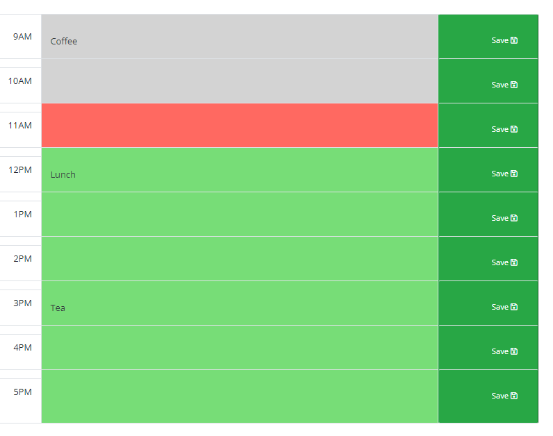

# ScheduleIt
Bootcamp Module 5. Third-Party APIs Challenge: Work Day Scheduler

# Description
This handy utility will help you organize your day.  It is a simple calendar application that allows a user to save events for each hour of the day. This app will run in the browser and feature dynamically updated HTML and CSS powered by jQuery.

# How to Use
Download the code and run locally in the browser (ie file:///C:filepathhere/ScheduleIt/index.html)

Enter data into the calendar and hit save.  When you refresh, the data will be there!

# User Story
AS AN employee with a busy schedule

I WANT to add important events to a daily planner

SO THAT I can manage my time effectively

# Acceptance Criteria
GIVEN I am using a daily planner to create a schedule 
**WHEN** I open the planner 
THEN the current day is displayed at the top of the calendar 
**WHEN** I scroll down 
THEN I am presented with time blocks for standard business hours 
**WHEN** I view the time blocks for that day 
THEN each time block is color-coded to indicate whether it is in the past, present, or future 
**WHEN** I click into a time block 
THEN I can enter an event 
**WHEN** I click the save button for that time block 
THEN the text for that event is saved in local storage 
**WHEN** I refresh the page 
THEN the saved events persist 

# Mockup

